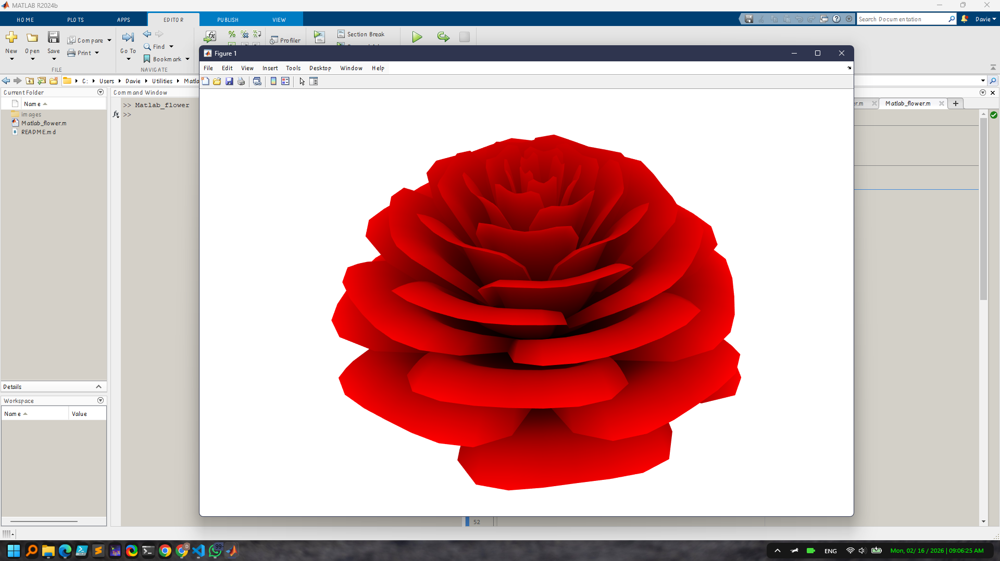

# MATLAB Red Rose Flower

This project showcases the mathematical beauty of nature by generating a stunning red rose flower illustration using MATLAB. The script leverages advanced mathematical modeling and plotting techniques to simulate the intricate structure and dynamic movement of rose petals. The project is ideal for those interested in mathematical art, MATLAB graphics, and creative coding.

## Features
- Realistic mathematical modeling of rose petals
- Dynamic animation of petal opening and closing
- Customizable parameters for petal count, openness, and shape
- Clean, compelling, and visually appealing output

*Figure: A mathematically generated red rose flower, illustrating the dynamic petal structure and vibrant color. The image was produced by running the MATLAB script included in this project.*

## Project Overview
The core script, `Matlab_flower.m`, uses polar coordinates and trigonometric functions to model the rose's petals. The animation simulates the opening and closing of petals, creating a lifelike effect. The code is modular, allowing easy adjustment of parameters such as the number of petals, openness, and petal separation to create different rose variations.

## Getting Started
1. Open `Matlab_flower.m` in MATLAB.
2. Run the script to generate the rose flower illustration and animation.
3. To customize the flower, modify parameters in the script (such as petal count, openness, or color).

### Customization Tips
- Change the number of petals by adjusting the `pnum` variable.
- Modify the openness and animation speed by tweaking the `openness` formula.
- Experiment with colors and plot styles for unique artistic effects.

## Example Output
The illustration above is an example output generated by the script. You can create your own variations by modifying the script parameters.

## Author
David Muigai

## License
This project is for educational and illustrative purposes.
